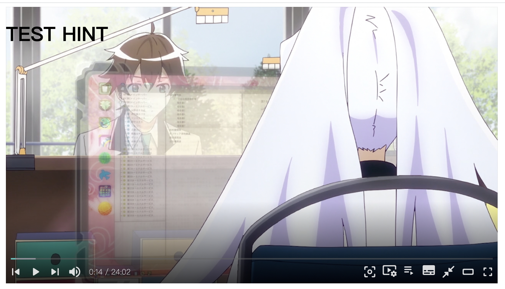
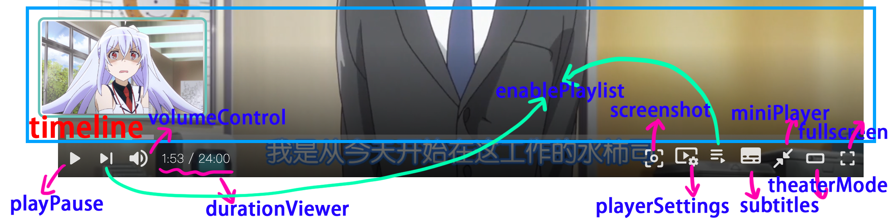
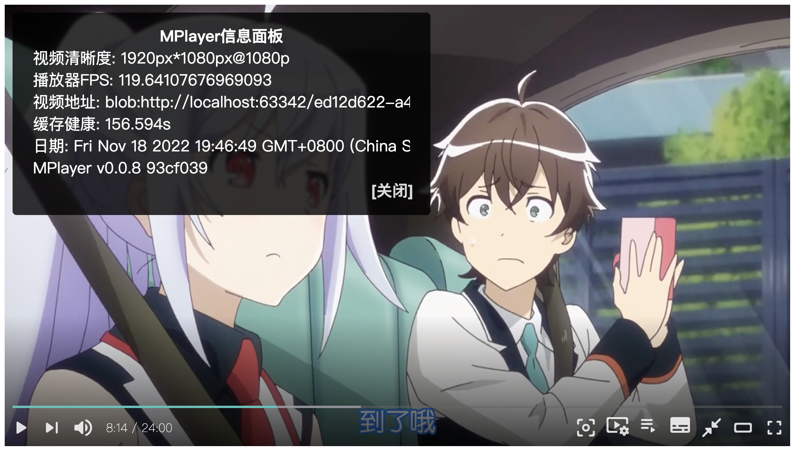
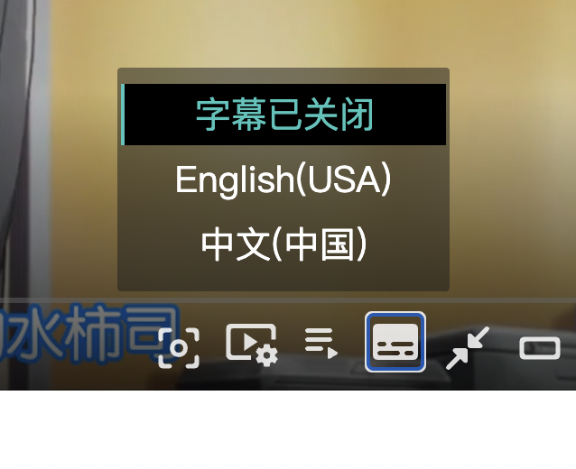

## 引入

### 使用 npm 安装

```bash
npm i @wenzi7777/mplayer@latest
```

### 或直接使用 cdn 引入

```html
<script src="https://cdn.jsdelivr.net/npm/@wenzi7777/mplayer@latest/dist/mplayer.bundle.min.js"></script>
```

## 初始化播放器
- 当**MPlayer**被以任何方式挂载到**window**对象上时，就可以使用**MPlayer类**来创建一个播放器实例。
- **MPlayer类**构造器接受两个参数，第一个参数是**播放器将被挂载到的元素**，第二个参数是**播放器参数**，均为必选参数。

MPlayer构造函数参数表：

|序号|参数|说明|是否必选|
|:--:|:--:|:--:|:--:|
|0|element|播放器将会被挂载到的元素|是|
|1|options|播放器参数|是|

**让我们初始化一个最简单的播放器吧！**
- 准备容器
```html
<div id="mplayer"></div>
```
- 引入MPlayer
**如果你使用模块管理器**
```javascript
import MPlayer from '@wenzi7777/mplayer';
const mplayer = new MPlayer(element, options);
```

**或者直接使用cdn**
```html
<script src="https://cdn.jsdelivr.net/npm/@wenzi7777/mplayer@latest/dist/mplayer.bundle.min.js"></script>
```

- 创建播放器对象
```html
<script>
    let options = {
        videos: [
            {
                title: 'video title',
                src: 'video src'
            }
        ]
    }
    const mplayer = new MPlayer(document.querySelector('#mplayer'), options)
</script>
```

## 播放器参数
**MPlayer**的构造器接受一个名为**options**的对象，您可以在其中定义值来个性化播放器。
|名称|默认值|可选值|类型|描述|是否必选|
|:--:|:--:|:--:|:--:|:--:|:--:|
|lang|en_US|zh_CN, zh_TW, en_US|String|播放器语言|否|
|playerMode|normal|normal, live|String|播放器模式|否|
|autoplay|false|true, false|Boolean|是否自动播放视频，请注意自动播放会在某些配置下的浏览器被禁用|否|
|hints|false|请在'参数详情'页面查看详细信息|Object|播放器'提示'功能|否|
|theme|#39c5bb|任意的Hex色值|String|可选任意的Hex色值来更换播放器主题色，注意不支持rgb或者rgba色值|否|
|tools|默认启用所有支持的工具|请参照'参数详情'页面|Array|播放器工具|否|
|hotkey|true|true, false|Boolean|是否启用热键|否|
|preload|true|true, false|Boolean|是否预加载|否|
|volume|1|任意属于的数值|Number|播放器音量大小|否|
|playbackRares|.25至2以.25划分一级的所有播放倍速|请参照'参数详情'来设定此值|Array|可选的播放倍速|否|
|index|0|任意数值|Number|播放器第一个播放的视频在videos数组中的下标|否|
|infoPanel|所有支持的信息|请参照'参数详情'页面|Array|播放器信息要展示的内容|否|
|contextMenu|两个选项，一个是指向本站的地址，一个是播放器信息|请参照'参数详情'来自定义指令|Array|播放器右键菜单|否|
|videos|无|请参照'参数详情'页面的提示自行构建这个数组|Array|播放器的视频列表|否|

## 参数详情

### lang
播放器语言，目前MPlayer支持【简体中文】、【正體字】、【English】。
请在源文件**[translation.js](https://github.com/wenzi7777/MPlayer/blob/main/src/js/translation.js)**查看可用的翻译或者添加你想要的翻译。
|可选值|释义|
|:--:|:--:|
|zh_CN|简体中文|
|zh_TW|正體字|
|en_US|English(USA)|

### playerMode
播放器模式，目前MPlayer仅支持normal模式
|可选值|释义|
|:--:|:--:|
|normal|普通播放器|
|live|直播模式（暂未支持）|

### autoplay
是否自动播放

**请注意，某些浏览器由于安全策略或者其他原因，特别是移动端浏览器均不支持开启自动播放。**
|可选值|释义|
|:--:|:--:|
|true|开启自动播放|
|false|关闭自动播放|

### hints
MPlayer提供的'提示'功能，默认为关闭。
开启提示后，可以在指定的时间段内，在MPlayer上展示内容。

**默认值**
```json
{
    "enabled": false
}
```

**使用示例**
```javascript
hints = {
  "enabled": true, // 标记为启用提示
  "elements": [ // 元素列表
      {
          "start": 10, // 开始展示的时间（秒）
            "end": 20, // 结束展示的时间（秒）
            "html": `<h1>TEST HINT</h1>` // 展示内容，您可以使用position定位元素
      }
  ]
}
```



### theme
播放器主题色

**更改此项会改变播放器的主题颜色，请注意，仅支持Hex色值（#39c5bb），并不支持rgb/rgba色值**

### tools
MPlayer视频控制器的组件，您可以自行决定使用哪些组件。

**默认值（全选）**
```javascript
['timeline', 'playPause', 'volumeControl', 'durationViewer', 'screenshot', 'playerSettings', 'enablePlaylist', 'subtitles', 'miniPlayer', 'theaterMode', 'fullscreen']
```

**使用示例**
```javascript
['timeline', 'playPause', 'durationViewer','fullscreen']
// 现在仅启用：进度条、开始/暂停、进度时间、全屏/退出全屏
```

|组件名|释义|
|:--:|:--:|
|timeline|进度条|
|playPause|播放/暂停|
|volumeControl|音量控制|
|durationViewer|进度数字|
|screenshot|截图|
|playerSettings|播放器设定|
|enablePlaylist|上一个/下一个/播放列表|
|subtitles|字幕控制|
|miniPlayer|小窗口播放（画中画模式）|
|theaterMode|观影模式|
|fullscreen|全屏幕/退出全屏幕|

**组件图像解释**


### hotkey
是否开启热键

|键|释义|
|:--:|:--:|
|空格/k|开始/暂停播放|
|f|全屏/退出全屏|
|t|进入/退出观影模式|
|i|进入/退出迷你播放器|
|m|静音/解除静音|
|方向左/j|后退5秒|
|方向右/l|前进5秒|

### preload
是否启用预加载

### volume
预先设置播放器音量，最大是1，最小是0

### playbackRates
要让使用者选择的倍率列表。

**默认值**
```javascript
[.25, .5, .75, 1, 1.25, 1.5, 1.75, 2]
```
您可以按照需要，自定增加或减少，最大值16，最小值0。

### index
播放器首选播放视频的下标

**默认值**
```javascript
0
```
若您的videos值的视频对象大于1个，则可以指定index值，让mplayer首选播放您选择的视频。

### infoPanel
播放器信息配置列表，您可以按照需求，自定义播放器信息内要展示的内容。

**默认值**
```javascript
['basicVideoInfo', 'playerFPS', 'videoURL', 'connectionStatus', 'date', 'playerInfo']
```
|值|释义|
|:--:|:--:|
|basicVideoInfo|基本视频信息|
|playerFPS|播放器帧率|
|videoURL|视频地址|
|connectionStatus|缓存健康|
|date|日期|
|playerInfo|MPlayer版本信息|



### contextMenu
播放器右键菜单，可以支持自定义。

**默认值**
```javascript
        [
            { // 此项为访问MPlayer官方网站的连接
                title: 'MPlayer',
                targetFunction: 'openLink',
                params: `https://www.1205.moe/mplayer`
            },
            { // 此项为打开/关闭播放器信息的选项
                title: 'Player Info',
                targetFunction: 'toggleInfoPanel'
            }
        ]
```

**参数定义**
如果您想新增选项，请遵循以下参数定义，并按照给出的模版新增您的选项到contextMenu数组中

模版
```jsonc
{
  "title": "title", // 链接标题
  "targetFunction": "function", // 连接点击后调用的目标函数名称
  "params": "test, test" // 连接点击后调用的目标函数所需要的参数，若无参可省略
}
```

|值|释义|是否必选|
|:--:|:--:|:--:|
|title|链接标题|是|
|targetFunction|目标函数(请在api详情内查看可用的选项)|否|
|params|参数|否|

### videos

**必选参数，如果不提供则无法初始化MPlayer**

最小化格式
```javascript
[
    {
        title: '视频标题', // 必须提供视频标题
        src: '视频地址' // 必须提供视频链接
    }
]
```

若想支持**进度条预览图**，则须**按照顺序**，提供**images**属性
```javascript
[
    {
        title: '视频标题', // 必须提供视频标题
        src: '视频地址', // 必须提供视频链接
        images: ['preview01.png', 'preview02.png'] // 进度条会按照数量自动适配预览图
    }
]
```


**MPlayer支持webvtt字幕**
若想支持**字幕**，则须提供**tracks**属性。
```javascript
[
    {
        title: '视频标题', // 必须提供视频标题
        src: '视频地址', // 必须提供视频链接
        images: ['preview01.png', 'preview02.png'], // 进度条会按照数量自动适配预览图
        tracks: [
                    {
                        srclang: 'en', // 字幕语言
                        src: './en_US.vtt', // 地址
                        label: "English(USA)",  // 显示给用户的选项名
                        kind: "captions" // 一般为captions
                    }
                    ]
    }
]
```
若想提供了多于一个字幕，则可以进行字幕切换
```javascript
[
    {
        title: '视频标题', // 必须提供视频标题
        src: '视频地址', // 必须提供视频链接
        images: ['preview01.png', 'preview02.png'], // 进度条会按照数量自动适配预览图
        tracks: [
                    {
                        srclang: 'en', // 字幕语言
                        src: './en_US.vtt', // 地址
                        label: "English(USA)",  // 显示给用户的选项名
                        kind: "captions" // 一般为captions
                    },
                    {
                        srclang: 'zh',
                        src: './zh_CN.vtt',
                        label: "中文(中国)",
                        kind: "captions"
                    }
                    ]
    }
]
```
